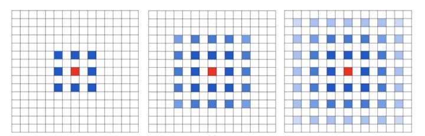
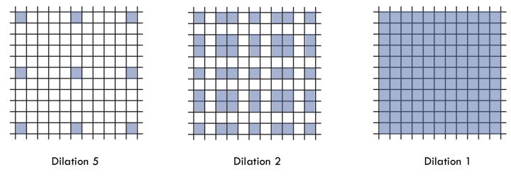

# 计算机视觉（Computer-Vision）
计算机视觉利用卷积神经网络来识别或理解图片中信息，三个方面的应用：图片分类（Classification）、物体检测（Object Detection）、语义分割（Semantic Segmentation）

- 图片分类（Classification）

识别图片的主体，如这是一张猫的图片，还是一张狗的图片

- 物体检测（Object Detection）

在一张图片中，识别出特殊物体，并描绘出物体的边框，如人脸检测（Face Detection），车辆检测（Viechle Detection）

- 语义分割(Semantic Segmentation)

在一张图片中，识别出图片中不同的物体，并与其他部分区分出来，如在一张马路场景图片中，识别那一部分是车，那一部分是马路，哪一部分是行人，标注和预测均为像素级。

此部分内容主要介绍语义分割

* 常用数据集：[VOC2012](http://cocodataset.org/#home)、[MSCOCO](http://host.robots.ox.ac.uk/pascal/VOC/voc2012/)
  
  
## 完全卷积网络(Fully Convolutional Networks)

目前大量的语义分割模型均利用了完全卷积网络，由加州大学伯克利分校的Long等人在2014年[Fully Convolutional Networks for Semantic Segmentation](https://arxiv.org/pdf/1411.4038.pdf)提出，推广了原有的CNN结构，在不带有全连接层的情况下能进行密集预测。


  - 将端到端的卷积网络推广到语义分割中；
  - 重新将预训练好的Imagenet网络用于分割问题中；
  - 使用反卷积层进行上采样；
  - 提出了跳跃连接来改善上采样的粗糙程度。
 
 后续主要介绍完全卷积网络中1x1卷积，转置卷积、跳跃连接三个部分
  
### 1x1卷积(1x1 Convolution)

完全卷积网络利用1x1卷积代替了全连接层，1x1卷积最早出现在Network In Network中，代替模型最后面的全连接层，主要有两方面的好处：
- 改变维度

全连接层使得数据扁平化，丢失了图片的空间信息，而1X1卷积可以改变维度（可以增加维度和降低维度），保留了空间信息
- 减少模型的参数

由于卷积网络可以共享参数，模型参数变少。以GoogLenet中Inception模型计算如下：

下图是其[论文](https://arxiv.org/abs/1409.4842)对GoogLeNet以及Inception的可视化


  Inception有四个通道构成：

  - 单个1X1卷积

  - 1X1卷积接一个3X3卷积。通常前者的通道数少于输入通道，这样减少后者的计算量，后者加上Padding=1使得输出的长宽的输入一致

  - 1X1卷积接一个5X5卷积。5X5卷积加入Padding=2使得输出的长宽的输入一致

  - 和2类似，使用了最大池化层

  假设输入大小为28x28x192：

  - a）图中1X1卷积通道为64，3X3卷积通道为128,5X5卷积通道为32；

  - b）图中3X3增加的1X1卷积通道为32,5X5卷积增加的1X1卷积通道为16，其他与a）相同

  a)参数量为：1x1x192x64+3x3x192x128+5x5x192x32+3x3x192x128=608256

  b)参数量为：1x1x192x64+（1x1x192x32+3x3x32x128）+（1x1x192x16+5x5x32x16）+（1x1x192x32+3x3x32x128）=114176

  计算得知，参数减少到18.8%，Resnet同样利用了1X1卷积减少模型参数
  
[SegNet: A Deep Convolutional Encoder-Decoder Architecture for Image Segmentation](https://arxiv.org/pdf/1511.00561.pdf)

### 转置卷积层 (Transposed Convolution)

卷积神经网络在卷积和池化过程中，高和宽都会不断缩减，如VGGnet高和宽都缩减为1/32。全卷积网络通过转置卷积层将中间层特征图的高和宽变换回输入图像的尺寸，从而令预测结果与输入图像在空间维（高和宽）上一一对应：给定空间维上的位置，通道维的输出即该位置对应像素的类别预测。

转置卷积层需要初始化，即上采样（upsample）。上采样的方法有很多，常用的有双线性插值。简单来说，为了得到输出图像在坐标(x,y)上的像素，先将该坐标映射到输入图像的坐标 (𝑥′,𝑦′)，例如根据输入与输出的尺寸之比来映射。李沐在《动手学习深度学习》中提供了bilinear_kernel函数的实现范例：
```
def bilinear_kernel(in_channels, out_channels, kernel_size):
    factor = (kernel_size + 1) // 2
    if kernel_size % 2 == 1:
        center = factor - 1
    else:
        center = factor - 0.5
    og = np.ogrid[:kernel_size, :kernel_size]
    filt = (1 - abs(og[0] - center) / factor) * \
           (1 - abs(og[1] - center) / factor)
    weight = np.zeros((in_channels, out_channels, kernel_size, kernel_size),
                      dtype='float32')
    weight[range(in_channels), range(out_channels), :, :] = filt
    return nd.array(weight)
```

### 跳跃连接(Skip Layer)

卷积和池化过程中，会丢失空间信息，在[Fully Convolutional Networks for Semantic Segmentation](https://arxiv.org/pdf/1411.4038.pdf)论文中，作者除了采取最后一个卷积层的特征外，还采取了第3个、第4个卷积层的特征，利用多个卷积层提供的特征，结果精度更高。论文提供的可视化图形如下：


### Project

#### 数据处理

图像增广(Data Augmentation)技术，可以扩充训练样本，增加训练样本的多样性，一方面可以避免过拟合，一方面可以带来模型性能的提升。常规的图像增广技术主要有水平翻转、Resize、随机Crop等技术，语义分割数据处理与常规图像增广有不一致的地方，不能使用Resize。对于输入大小不一致的图片，经过Resize处理后，输出结果和Resize后的尺寸一致，和label不能一一对应，所以不能采用Resize处理，但可以使用Crop处理，以Gluon为例，实现代码如下：
```
from mxnet import image
def voc_rand_crop(feature, label, height, width):
    //进行Random Crop，并返回Crop区域
    feature, rect = image.random_crop(feature, (width, height))
    //对label进行固定Crop
    label = image.fixed_crop(label, *rect)
    return feature, label
```

#### 性能度量

错误率和精度是很常用的性能度量工具，但不能满足所有要求，本项目利用IOU(Intersection Over Union)来衡量模型性能。混淆矩阵如下：


$ IOU = \frac{TP}{TP + FN + FP} $


空洞卷积(Dilated Convolution)

传统语义分割卷积操作，通过卷积计算提取特征，通过池化(Pooling)增加感受野，在通过上采样(Upsampling)还原尺寸得到与输入大小一致的输出，但是池化过程中丢失了部分信息，长采样不能无损还原。而空洞卷积不使用池化操作，因此保留了数据的内部结构，避免了特征损失，而空洞卷积本身可以扩大感受野。


空洞的尺寸为参数Dilation决定，上图为Dilation=1的情形，Dilation=0即为传统卷积，Dilation越大，感受野越大。空洞卷积在增大感受野的同时，避免了特征损失，但存在两个问题：
- The Gridding Effort

Kernel不连续，可能存在部分pixel信息没有利用的现象，如仅仅使用Dilation=2，部分信息得不到利用


- Dilation参数对检测对象的大小敏感

大Dilation Rate对大尺寸物体(近距离)分割有效，小Dilation Rate对小物体(远距离)分割有效，不能通用

上述两个问题，可以通过合理设计网络来解决

Hybrid Dilated Convolutio(HDC)

- Dilation Rate公约数为1
- 锯齿状结构。如[1,2,5,1,2,5]
- 

$$Mi = max(M_{i+1} - 2*r_{i}, M_{i+1} - 2*(M_{i+1} - r_i), r_i)$$

一个简单的例子: dilation rate [1, 2, 5] with 3 x 3 kernel


多尺寸分割

空间金字塔池化(Atrous Spatial Pyramid Pooling)(ASPP)

对于CNN+FC网络结构，CNN对输入数据结构不敏感，而FC输入数据结构固定，因此需要对输入数据进行处理：
- Reshape：容易造成物体变形
- Crop：可能会是的部分区域权重过大

[Spatial Pyramid Pooling in Deep Convolutional Networks for Visual Recognition](https://arxiv.org/pdf/1406.4729.pdf), 论文提出了金字塔池化方法通过不同卷积层提取特征，根据输出要求来调整卷积的参数，从而得到固定大小的输出，然后合并结果作为输出，这样做有两个好处：
- 适用于任何尺寸输出
- 多方面提取图片特征


假设输入大小为w*h,为了得到输出尺寸为n*n的结果，可以采用步长Stride为Floor[w/n,h/n]窗口大小为Ceil[w/n,h/n]的卷积核，根据试验结果，计算开销近似，精度提升1%~2%

空间金字塔池化有两种做法：

- 第一种方法，在一个卷积分支下，采用不同Dilation Rate空洞卷积提取特征。大Dilation Rate提取大、近距离的物体；小Dilation Rate提取小、远距离的物体

- 第二种方法，通过多个独立的卷积网络分支提取特征，不同Dilation Rate抓取多尺寸信息，合并卷积层结果输出预测结果


