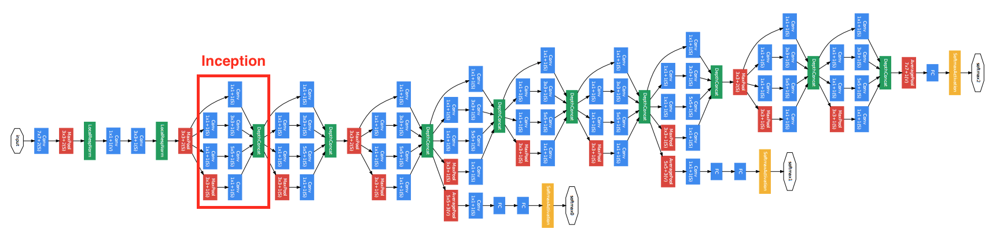
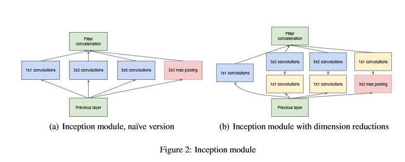

# 计算机视觉（Computer-Vision）
计算机视觉利用卷积神经网络来识别或理解图片中信息，三个方面的应用：图片分类（Classification）、物体检测（Object Detection）、语义分割（Semantic Segmentation）

- 图片分类（Classification）

识别图片的主体，如这是一张猫的图片，还是一张狗的图片

- 物体检测（Object Detection）

在一张图片中，识别出特殊物体，并描绘出物体的边框，如人脸检测（Face Detection），车辆检测（Viechle Detection）

- 语义分割

在一张图片中，识别出图片中不同的物体，并与其他部分区分出来，如在一张马路场景图片中，识别那一部分是车，那一部分是马路，哪一部分是行人，标注和预测均为像素级。

此部分内容主要介绍语义分割

* 常用数据集：[VOC2012](http://cocodataset.org/#home)、[MSCOCO](http://host.robots.ox.ac.uk/pascal/VOC/voc2012/)
  
  
## 全连接卷积网络

目前大量的语义分割模型均利用了完全卷积网络，由加州大学伯克利分校的Long等人在2014年[Fully Convolutional Networks for Semantic Segmentation](https://arxiv.org/pdf/1411.4038.pdf)提出，推广了原有的CNN结构，在不带有全连接层的情况下能进行密集预测。

  - 将端到端的卷积网络推广到语义分割中；
  - 重新将预训练好的Imagenet网络用于分割问题中；
  - 使用反卷积层进行上采样；
  - 提出了跳跃连接来改善上采样的粗糙程度。
 
 后续主要介绍完全卷积网络中1x1卷积，上采样、跳跃连接三个部分
  
### 1x1卷积(1x1 Convolution)

完全卷积网络利用1x1卷积代替了全连接层，1x1卷积最早出现在Network In Network中，代替模型最后面的全连接层，主要有两方面的好处：
- 改变维度
全连接层使得数据扁平化，丢失了图片的空间信息，而1X1卷积可以改变维度（可以增加维度和降低维度），保留了空间信息
- 减少模型的参数
由于卷积网络可以共享参数，模型参数变少。以GoogLenet中Inception模型计算如下：

下图是其[论文](https://arxiv.org/abs/1409.4842)对GoogLeNet以及Inception的可视化

  Inception有四个通道构成：

  - 单个1X1卷积

  - 1X1卷积接一个3X3卷积。通常前者的通道数少于输入通道，这样减少后者的计算量，后者加上Padding=1使得输出的长宽的输入一致

  - 1X1卷积接一个5X5卷积。5X5卷积加入Padding=2使得输出的长宽的输入一致

  - 和2类似，使用了最大池化层

  假设输入大小为28*28*192：

  - a）图中1X1卷积通道为64，3X3卷积通道为128,5X5卷积通道为32；

  - b）图中3X3增加的1X1卷积通道为32,5X5卷积增加的1X1卷积通道为16，其他与a）相同

  a)参数量为：1x1x192x64+3x3x192x128+5x5x192x32+3x3x192x128=608256

  b)参数量为：1x1x192x64+（1x1x192x32+3x3x32x128）+（1x1x192x16+5x5x32x16）+（1x1x192x32+3x3x32x128）=114176

  计算得知，参数减少到18.8%，Resnet同样利用了1X1卷积减少模型参数

  
  
[SegNet: A Deep Convolutional Encoder-Decoder Architecture for Image Segmentation](https://arxiv.org/pdf/1511.00561.pdf)

### 空洞卷积网络

