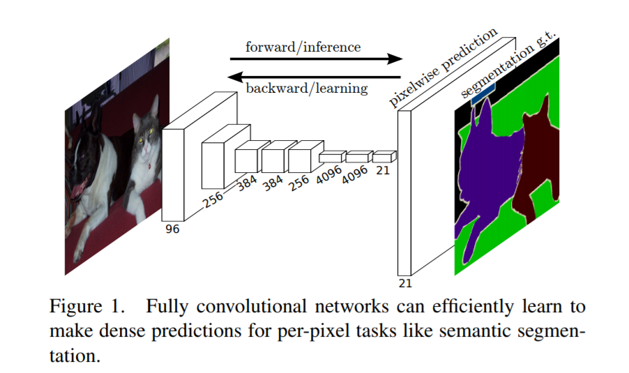
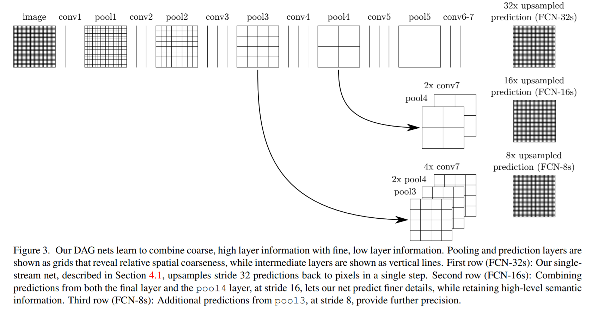
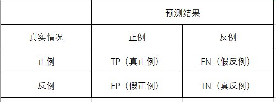

# 计算机视觉（Computer-Vision）
计算机视觉利用卷积神经网络来识别或理解图片中信息，三个方面的应用：图片分类（Classification）、物体检测（Object Detection）、语义分割（Semantic Segmentation）

- 图片分类（Classification）

识别图片的主体，如这是一张猫的图片，还是一张狗的图片

- 物体检测（Object Detection）

在一张图片中，识别出特殊物体，并描绘出物体的边框，如人脸检测（Face Detection），车辆检测（Viechle Detection）

- 语义分割(Semantic Segmentation)

在一张图片中，识别出图片中不同的物体，并与其他部分区分出来，如在一张马路场景图片中，识别那一部分是车，那一部分是马路，哪一部分是行人，标注和预测均为像素级。

此部分内容主要介绍语义分割

* 常用数据集：[VOC2012](http://cocodataset.org/#home)、[MSCOCO](http://host.robots.ox.ac.uk/pascal/VOC/voc2012/)
  
  
## 完全卷积网络(Fully Convolutional Networks)

目前大量的语义分割模型均利用了完全卷积网络，由加州大学伯克利分校的Long等人在2014年[Fully Convolutional Networks for Semantic Segmentation](https://arxiv.org/pdf/1411.4038.pdf)提出，推广了原有的CNN结构，在不带有全连接层的情况下能进行密集预测。



  - 将端到端的卷积网络推广到语义分割中；
  - 重新将预训练好的Imagenet网络用于分割问题中；
  - 使用反卷积层进行上采样；
  - 提出了跳跃连接来改善上采样的粗糙程度。
 
 后续主要介绍完全卷积网络中1x1卷积，转置卷积、跳跃连接三个部分
  
### 1x1卷积(1x1 Convolution)

完全卷积网络利用1x1卷积代替了全连接层，1x1卷积最早出现在Network In Network中，代替模型最后面的全连接层，主要有两方面的好处：
- 改变维度

全连接层使得数据扁平化，丢失了图片的空间信息，而1X1卷积可以改变维度（可以增加维度和降低维度），保留了空间信息
- 减少模型的参数

由于卷积网络可以共享参数，模型参数变少。以GoogLenet中Inception模型计算如下：

下图是其[论文](https://arxiv.org/abs/1409.4842)对GoogLeNet以及Inception的可视化


  Inception有四个通道构成：

  - 单个1X1卷积

  - 1X1卷积接一个3X3卷积。通常前者的通道数少于输入通道，这样减少后者的计算量，后者加上Padding=1使得输出的长宽的输入一致

  - 1X1卷积接一个5X5卷积。5X5卷积加入Padding=2使得输出的长宽的输入一致

  - 和2类似，使用了最大池化层

  假设输入大小为28x28x192：

  - a）图中1X1卷积通道为64，3X3卷积通道为128,5X5卷积通道为32；

  - b）图中3X3增加的1X1卷积通道为32,5X5卷积增加的1X1卷积通道为16，其他与a）相同

  a)参数量为：1x1x192x64+3x3x192x128+5x5x192x32+3x3x192x128=608256

  b)参数量为：1x1x192x64+（1x1x192x32+3x3x32x128）+（1x1x192x16+5x5x32x16）+（1x1x192x32+3x3x32x128）=114176

  计算得知，参数减少到18.8%，Resnet同样利用了1X1卷积减少模型参数
  
[SegNet: A Deep Convolutional Encoder-Decoder Architecture for Image Segmentation](https://arxiv.org/pdf/1511.00561.pdf)

### 转置卷积层 (ransposed Convolution)

卷积神经网络在卷积和池化过程中，高和宽都会不断缩减，如VGGnet高和宽都缩减为1/32。全卷积网络通过转置卷积层将中间层特征图的高和宽变换回输入图像的尺寸，从而令预测结果与输入图像在空间维（高和宽）上一一对应：给定空间维上的位置，通道维的输出即该位置对应像素的类别预测。

转置卷积层需要初始化，即上采样（upsample）。上采样的方法有很多，常用的有双线性插值。简单来说，为了得到输出图像在坐标(x,y)上的像素，先将该坐标映射到输入图像的坐标 (𝑥′,𝑦′)，例如根据输入与输出的尺寸之比来映射。李沐在《动手学习深度学习》中提供了bilinear_kernel函数的实现范例：
```
def bilinear_kernel(in_channels, out_channels, kernel_size):
    factor = (kernel_size + 1) // 2
    if kernel_size % 2 == 1:
        center = factor - 1
    else:
        center = factor - 0.5
    og = np.ogrid[:kernel_size, :kernel_size]
    filt = (1 - abs(og[0] - center) / factor) * \
           (1 - abs(og[1] - center) / factor)
    weight = np.zeros((in_channels, out_channels, kernel_size, kernel_size),
                      dtype='float32')
    weight[range(in_channels), range(out_channels), :, :] = filt
    return nd.array(weight)
```

### 跳跃连接(Skip Layer)

卷积和池化过程中，会丢失空间信息，在[Fully Convolutional Networks for Semantic Segmentation](https://arxiv.org/pdf/1411.4038.pdf)论文中，作者除了采取最后一个卷积层的特征外，还采取了第3个、第4个卷积层的特征，利用多个卷积层提供的特征，结果精度更高。论文提供的可视化图形如下：




### Project

#### 数据处理

图像增广

图像增广

语义分割数据处理与常规图像增广有不一致的地方，对于输入大小不一致的图片，经过Resize处理后，输出结果和Resize后的尺寸一致，和label不能一一对应，所以不能采用Resize处理，但可以使用Crop处理，以Gluon为例，实现代码如下：
```
from mxnet import image
def voc_rand_crop(feature, label, height, width):
    //进行Random Crop，并返回Crop区域
    feature, rect = image.random_crop(feature, (width, height))
    //对label进行固定Crop
    label = image.fixed_crop(label, *rect)
    return feature, label
```


#### 性能度量

错误率和精度是很常用的性能度量工具，但不能满足所有要求，本项目利用IOU(Intersection Over Union)来衡量模型性能。混淆矩阵如下：


IOU = TP/(TP + FN + FP)
  


